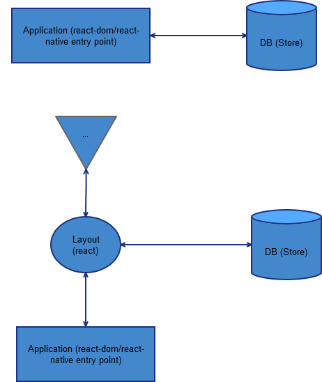
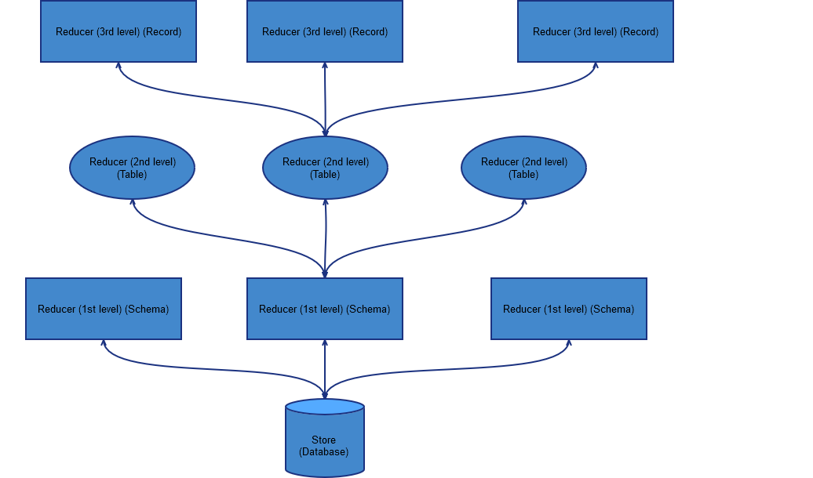
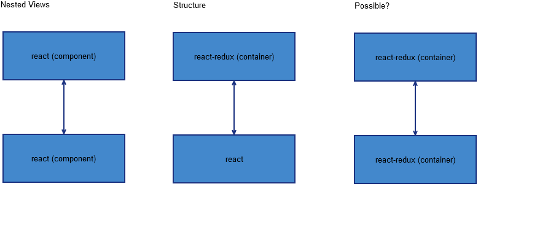
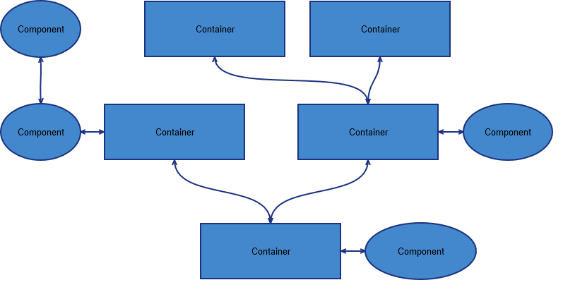

# react-redux-explained

(a naive explanaition for myself during learning these things)

## Application root

As in any application using a database, on the initialization part of it you'll make the connection, usually by selecting the schema, too, in case we consider that we can connect to whole database.

In the first part presented below it is a simple relation, usually found in all React/Redux examples, but, I found that, if you want to build a more flexible application - as ex using React Native, too - it's a bit better to use the second.  

  
  
## Redux

Redux represents more a document database, but, for the sake of simplicity I draw it and explained as a relational database, as seen below. Using a unique store is quite enough, you can justify a second store only if you have to separate applications in the same project.
 
Also, the levels presented here are flexible and orientative, you can add/remove as many levels and Reducers as you want on any branch. Shown is just convention for comparison.  

 

## RRMVC

One of the definitions of MVC architecture is shown as below:

<!---->


That's why, in a simplified model React/Redux can be represented in the same way:


## Stacking

Stacking the Components/Containers is possible in 2 ways. 

The 3rd representation probably, not yet experimented, I don't know if is over-engineering. Probably gives some flexibility with the cost of extra code.   



Trying to figure out what would be interesting to use I realized that: 

First way is the way of a React only stacking, a normal way to stack dumb components without implying Redux. Absolutely the way to go if you want a separation of elements displayed in the page. 

Second way is specific to Redux way of stacking, the main issue with that is that you have to import stuff between containers and components and, at a certain point, it becomes difficult to follow the structure. Going back and forth between containers and components can give some confusion when, sometimes, you're naming the file in the same way.
 
### 3rd way thoughts
 
Third way is probably a better way in having only one fashion to require things. Components can import only components (first model), containers can import only a component (a container that represent that component) or only containers (pass child containers to parent container). Result is boilerplating. It worth it? How do we pass a container to a component? 

Now we have "component containers" and "layout containers". Damn, it's becoming overkill.

One way could be by using `this.props.children`, not so sure is very likeable. 

```
    var Wrap = React.createClass({
        render: function() {
            return <div>{ this.props.children }</div>;
        }
    });
    
    var App = React.createClass({
        render: function() {
            return <Wrap><h1>Hello word</h1></Wrap>;
        }
    });
```

A better way (in my opinion, lets see if feasible) is to pass containers through props, and define them into contract as `React.PropTypes.element`. In this way we will stay in the actual container definition.

A container can import other containers and one component and can pass to props only containers (why you should pass components?), a component can import only other components.



In this very moment we will obtain a damn crazy piece of structure.

## Application organisation / Project structure 

Kind of difficult to chose, depends on the size of the project. I would chose a more complex one even for a simple project.

http://engineering.kapost.com/2016/01/organizing-large-react-applications/

http://jaysoo.ca/2016/02/28/organizing-redux-application/

http://marmelab.com/blog/2015/12/17/react-directory-structure.html

As already said in different articles there is a short tree of defining by nature the folders, that fails in bigger applications. Even grouping by domain, better than previous, fails in my opinion by repeating same wordings again and again.

I would use a deeper structure, not to deep as it can result in too big require paths, but deep enough to give an understandable and meaningful view over the application.
 
### Pods and Apps of Apps
 
Apps of Apps can become a huge tree, the concept of Pods being more appealing for me as you can import a Pod into another. So lets debate Pods project structure, Features First.

```
src/
  auth/
    redux/
      actions/
      reducers/
    components/
      todo/
      addTodo/
    helpers/
    container1.js
    container2.js
    appReducer.js
    index.js
  comments/
    redux/
    components/
    helpers/
    container1.js
    container2.js
    appReducer.js
    index.js
  todos/
    . . .
  mainLayout/
    . . .
  . . .
  mainReducer.js
```
 
The last level, defining another set of functionalities, it's needed only for a stack that builds for different platforms, as ex React and React Native, as contains files for each platform. 
 
As for the redux folder I would prefer something that generates actions from reducers or reducers from actions, something that you are defining once and have both as a result.
 
Containers are placed just in the root of each Pod, naturally requiring from subfolders. A container can also import a container from another Pod.
  
`index.js` can replace very well `appReducer.js` by returning that and the main container of the Pod, probably the best way to allow easier a Pod into another.
