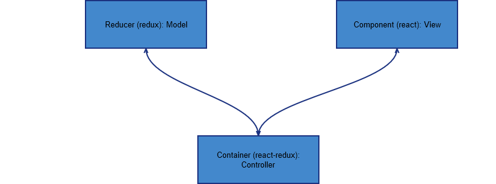

# react-redux-explained

(a naive explanaition for myself during learning these things)

## Application root

As in any application using a database, on the initialization part of it you'll make the connection, usually by selecting the schema, too, in case we consider that we can connect to whole database.

In the first part presented below it is a simple relation, usually found in all React/Redux examples, but, I found that, if you want to build a more flexible application - as ex using React Native, too - it's a bit better to use the second.  

  
  
## Redux

Redux represents more a document database, but, for the sake of simplicity I draw it and explained as a relational database, as seen below. Using a unique store is quite enough, you can justify a second store only if you have to separate applications in the same project.
 
Also, the levels presented here are flexible and orientative, you can add/remove as many levels and Reducers as you want on any branch. Shown is just convention for comparison.  

 

## RRMVC

One of the definitions of MVC architecture is shown as below:

That's why, in a simplified model React/Redux can be represented in the same way:

